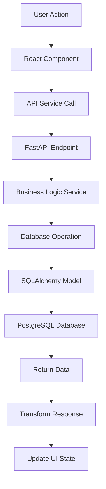

# Phase 2: Core App Features - Detailed Implementation Plan

## 🎯 Phase 2 Overview

**Goal**: Transform the authentication foundation into a functional expense tracking application with real data persistence and core CRUD operations.

**Duration**: 1-2 weeks
**Status**: 🚧 Ready to Start
**Prerequisites**: ✅ Phase 1 Complete (Authentication & UI Foundation)

## 🏗️ Phase 2 Architecture Strategy

### **Core Philosophy**: "Make It Work, Then Make It Smart"
1. **Real Data First**: Move from mock data to actual database persistence
2. **Core Features**: Implement essential expense tracking functionality
3. **API Integration**: Connect frontend to working FastAPI backend
4. **User Experience**: Polish the user flow for expense management

## 📋 Phase 2 Detailed Tasks

### **2.1 Backend API Implementation (Week 1, Days 1-3)**

#### **Database Schema Setup**
```sql
-- Expense tracking tables
CREATE TABLE categories (
    id SERIAL PRIMARY KEY,
    name VARCHAR(100) NOT NULL,
    color VARCHAR(7) DEFAULT '#3b82f6',
    icon VARCHAR(50) DEFAULT '💰',
    created_at TIMESTAMP DEFAULT CURRENT_TIMESTAMP
);

CREATE TABLE expenses (
    id SERIAL PRIMARY KEY,
    user_id INTEGER REFERENCES users(id) ON DELETE CASCADE,
    category_id INTEGER REFERENCES categories(id),
    amount DECIMAL(10,2) NOT NULL,
    description TEXT NOT NULL,
    date DATE NOT NULL DEFAULT CURRENT_DATE,
    created_at TIMESTAMP DEFAULT CURRENT_TIMESTAMP,
    updated_at TIMESTAMP DEFAULT CURRENT_TIMESTAMP
);

CREATE TABLE budgets (
    id SERIAL PRIMARY KEY,
    user_id INTEGER REFERENCES users(id) ON DELETE CASCADE,
    category_id INTEGER REFERENCES categories(id),
    amount DECIMAL(10,2) NOT NULL,
    period VARCHAR(20) DEFAULT 'monthly', -- monthly, weekly, yearly
    start_date DATE NOT NULL,
    end_date DATE,
    created_at TIMESTAMP DEFAULT CURRENT_TIMESTAMP
);
```

#### **FastAPI Endpoints to Build**
```python
# backend/app/api/endpoints/expenses.py
@router.post("/expenses", response_model=ExpenseResponse)
@router.get("/expenses", response_model=List[ExpenseResponse])
@router.get("/expenses/{expense_id}", response_model=ExpenseResponse)
@router.put("/expenses/{expense_id}", response_model=ExpenseResponse)
@router.delete("/expenses/{expense_id}")

# backend/app/api/endpoints/categories.py
@router.get("/categories", response_model=List[CategoryResponse])
@router.post("/categories", response_model=CategoryResponse)

# backend/app/api/endpoints/dashboard.py
@router.get("/dashboard/summary", response_model=DashboardSummary)
@router.get("/dashboard/recent-expenses", response_model=List[ExpenseResponse])
```

#### **Backend Implementation Priority Order**
1. **Database Models**: User, Expense, Category, Budget models
2. **Expense CRUD API**: Complete create, read, update, delete operations
3. **Category Management**: Default categories + custom user categories
4. **Dashboard Data API**: Summary statistics and recent expenses
5. **Data Validation**: Proper input validation and error handling

### **2.2 Frontend Dashboard Enhancement (Week 1, Days 4-5)**

#### **Dashboard Components to Build**
```javascript
// src/screens/dashboard/DashboardScreen.js enhancements
- ExpenseOverviewWidget    # Total spent this month
- CategoryBreakdownChart   # Pie/donut chart of spending by category
- RecentExpensesList       # Last 10 expenses with edit/delete
- QuickAddExpenseButton    # Floating action button
- MonthlyBudgetProgress    # Progress bars for budget categories
```

#### **Dashboard Data Flow**
```javascript
// Dashboard data fetching strategy
useEffect(() => {
  // Parallel data fetching for dashboard
  Promise.all([
    apiService.getDashboardSummary(),
    apiService.getRecentExpenses(10),
    apiService.getCategoryBreakdown('month'),
    apiService.getBudgetProgress()
  ]).then(([summary, expenses, breakdown, budgets]) => {
    setDashboardData({ summary, expenses, breakdown, budgets });
  });
}, []);
```

### **2.3 Expense Management System (Week 2, Days 1-3)**

#### **Expense Form Component**
```javascript
// src/components/forms/ExpenseForm.js
- Amount input with currency formatting
- Category selection dropdown
- Description text input
- Date picker (defaults to today)
- Form validation and error handling
- Save/Cancel buttons
```

#### **Expense List Management**
```javascript
// src/screens/expenses/ExpenseListScreen.js
- Searchable/filterable expense list
- Group by date, category, or amount
- Swipe-to-delete functionality
- Edit expense inline or modal
- Pagination for large expense lists
```

#### **Category Management**
```javascript
// src/screens/categories/CategoryScreen.js
- Default categories (Food, Transport, Entertainment, etc.)
- Custom category creation
- Category color and icon selection
- Category usage statistics
```

### **2.4 Database Integration (Week 2, Days 4-5)**

#### **Real PostgreSQL Setup**
```bash
# Development database setup
docker run --name budget-tracker-db \
  -e POSTGRES_DB=budget_tracker \
  -e POSTGRES_USER=budget_user \
  -e POSTGRES_PASSWORD=budget_pass \
  -p 5432:5432 -d postgres:15

# Run database migrations
cd backend
python manage.py migrate
```

#### **API Integration Testing**
```javascript
// Frontend integration testing checklist
- User signup/login flows with real database
- Expense creation and retrieval
- Category management
- Dashboard data loading
- Error handling for API failures
```

## 🛠️ Technical Implementation Details

### **2.1 Backend Implementation**

#### **File Structure to Create**
```
backend/app/
├── models/
│   ├── expense.py              # Expense database model
│   ├── category.py             # Category database model
│   └── budget.py               # Budget database model
├── api/endpoints/
│   ├── expenses.py             # Expense CRUD endpoints
│   ├── categories.py           # Category management endpoints
│   └── dashboard.py            # Dashboard data endpoints
├── schemas/
│   ├── expense.py              # Pydantic schemas for validation
│   ├── category.py             # Category request/response schemas
│   └── dashboard.py            # Dashboard response schemas
└── services/
    ├── expense_service.py      # Business logic for expenses
    └── dashboard_service.py    # Dashboard data aggregation
```

#### **Database Models (SQLAlchemy)**
```python
# backend/app/models/expense.py
class Expense(Base):
    __tablename__ = "expenses"
    
    id = Column(Integer, primary_key=True, index=True)
    user_id = Column(Integer, ForeignKey("users.id"), nullable=False)
    category_id = Column(Integer, ForeignKey("categories.id"))
    amount = Column(Numeric(10, 2), nullable=False)
    description = Column(Text, nullable=False)
    date = Column(Date, nullable=False, default=date.today)
    created_at = Column(DateTime, default=datetime.utcnow)
    updated_at = Column(DateTime, default=datetime.utcnow, onupdate=datetime.utcnow)
    
    # Relationships
    user = relationship("User", back_populates="expenses")
    category = relationship("Category", back_populates="expenses")
```

### **2.2 Frontend Implementation**

#### **New Components to Build**
```javascript
// Component hierarchy for Phase 2
src/components/
├── forms/
│   ├── ExpenseForm.js          # Main expense entry form
│   ├── CategorySelector.js     # Category dropdown with icons
│   └── DatePicker.js           # Date selection component
├── expenses/
│   ├── ExpenseCard.js          # Individual expense display
│   ├── ExpenseList.js          # List of expenses with actions
│   └── ExpenseFilter.js        # Filter and search controls
├── dashboard/
│   ├── SummaryWidget.js        # Total spending summary
│   ├── CategoryChart.js        # Spending breakdown chart
│   ├── RecentExpenses.js       # Recent expenses list
│   └── QuickActions.js         # Quick expense entry
└── charts/
    ├── PieChart.js             # Category breakdown pie chart
    └── BarChart.js             # Monthly spending bar chart
```

#### **Screen Updates**
```javascript
// Enhanced screens for Phase 2
src/screens/
├── dashboard/
│   └── DashboardScreen.js      # ✅ Enhanced with real data widgets
├── expenses/
│   ├── ExpenseListScreen.js    # 🆕 Full expense management
│   ├── AddExpenseScreen.js     # 🆕 Expense creation form
│   └── EditExpenseScreen.js    # 🆕 Expense editing
└── categories/
    └── CategoryScreen.js       # 🆕 Category management
```

## 📊 Data Flow Architecture

### **Frontend → Backend → Database Flow**


### **State Management Strategy**
```javascript
// Context-based state management for expenses
const ExpenseContext = createContext();

const ExpenseProvider = ({ children }) => {
  const [expenses, setExpenses] = useState([]);
  const [categories, setCategories] = useState([]);
  const [dashboardData, setDashboardData] = useState({});
  const [loading, setLoading] = useState(false);

  // CRUD operations
  const addExpense = async (expenseData) => { /* ... */ };
  const updateExpense = async (id, expenseData) => { /* ... */ };
  const deleteExpense = async (id) => { /* ... */ };
  const fetchExpenses = async (filters) => { /* ... */ };

  return (
    <ExpenseContext.Provider value={{
      expenses, categories, dashboardData,
      addExpense, updateExpense, deleteExpense, fetchExpenses
    }}>
      {children}
    </ExpenseContext.Provider>
  );
};
```

## 🧪 Testing Strategy for Phase 2

### **Backend Testing**
```python
# Test coverage for Phase 2
- test_expense_crud.py          # CRUD operations
- test_category_management.py   # Category operations
- test_dashboard_data.py        # Dashboard endpoint testing
- test_user_isolation.py        # Ensure user data separation
- test_validation.py            # Input validation testing
```

### **Frontend Testing**
```javascript
// React Testing Library tests
- ExpenseForm.test.js           # Form validation and submission
- ExpenseList.test.js           # List operations and interactions
- DashboardScreen.test.js       # Dashboard data loading
- API integration tests         # Real API call testing
```

### **Integration Testing**
```javascript
// End-to-end testing scenarios
1. User creates account → Logs in → Adds expenses → Views dashboard
2. User edits expense → Deletes expense → Manages categories
3. User logs out → Logs back in → Data persists correctly
```

## 🎯 Success Criteria for Phase 2

### **Functional Requirements**
- ✅ User can add expenses with category, amount, description, date
- ✅ User can view, edit, and delete their expenses
- ✅ Dashboard shows real expense data and summaries
- ✅ Categories can be managed (default + custom)
- ✅ Data persists between sessions
- ✅ User data is properly isolated (users only see their own expenses)

### **Technical Requirements**
- ✅ FastAPI backend with PostgreSQL database
- ✅ Proper API authentication and authorization
- ✅ Input validation and error handling
- ✅ Responsive UI that works on mobile and desktop
- ✅ Performance: Dashboard loads in <2 seconds
- ✅ Data integrity: No lost or corrupted expense data

### **User Experience Requirements**
- ✅ Intuitive expense entry flow
- ✅ Easy expense editing and deletion
- ✅ Clear visual feedback for all actions
- ✅ Professional, polished UI matching Phase 1 quality
- ✅ Consistent navigation and interaction patterns

## 🚀 Phase 2 to Phase 3 Transition

### **What Phase 2 Delivers**
- Fully functional expense tracking application
- Real database persistence
- Complete CRUD operations
- Professional dashboard with real data
- Solid foundation for AI integration

### **What Phase 3 Will Add**
- AI-powered expense categorization
- Smart financial insights and advice
- Spending pattern analysis
- Goal tracking and predictions
- Advanced data visualization

## ⚡ Quick Start Commands for Phase 2

```bash
# Start Phase 2 development
git checkout -b feature/phase-2-core-features

# Backend setup
cd backend
python -m venv venv
source venv/bin/activate
pip install -r requirements.txt

# Database setup
docker run --name budget-tracker-db \
  -e POSTGRES_DB=budget_tracker \
  -e POSTGRES_USER=budget_user \
  -e POSTGRES_PASSWORD=budget_pass \
  -p 5432:5432 -d postgres:15

# Frontend development
npm start  # Continue development server

# Test the current authentication (Phase 1)
# Then begin implementing expense management (Phase 2)
```

---

**This Phase 2 plan provides a complete, executable roadmap that transforms your authentication foundation into a fully functional expense tracking application, setting up the perfect foundation for AI integration in Phase 3.**
